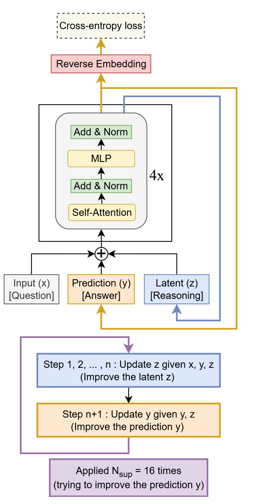

# TRM - Tiny Recursive Model

[](https://opensource.org/licenses/MIT)
[](https://www.python.org/downloads/)
[](https://pytorch.org/)

**Tiny Recursive Model (TRM)** - Complete PyTorch Implementation from Scratch

*Based on the paper: "Less is More: Recursive Reasoning with Tiny Networks"*

<div align="center">
  
</div>

## 📖 Overview

TRM is a novel neural architecture that achieves powerful reasoning capabilities through **recursive computation** with a tiny network. Instead of scaling up model size, TRM leverages:

- 🔄 **Recursive Reasoning**: Iteratively refines answers through multiple cycles
- 🎯 **Deep Supervision**: Learns from intermediate predictions at each refinement step
- ⚡ **Adaptive Computation Time (ACT)**: Dynamically determines when to stop reasoning
- 💡 **Dual State Design**: Maintains separate answer (y) and latent reasoning (z) states

### Key Innovation

The core idea is elegantly simple:
```
For each refinement cycle:
  1. Update latent reasoning: z ← f(x + y + z)  [n times]
  2. Update answer:          y ← f(y + z)      [1 time]
  3. Predict if done:        halt ← should_stop(y)
```

This allows a tiny network to solve complex reasoning tasks (like Sudoku) by thinking iteratively rather than requiring massive scale.

> 📝 **Want to learn more?** Check out the [in-depth blog post](https://dinmaysblog.onrender.com/post/samsung-s-tiny-recursive-model-trm) for a detailed explanation of TRM architecture and implementation.

## 🏗️ Architecture

### Mathematical Formulation

Given input **x**, initialize **y**=0 (answer), **z**=0 (latent reasoning):

```
For supervision_step = 1 to K:
    For cycle = 1 to T:
        # Reasoning phase (n steps)
        For i = 1 to n:
            z ← f_net(x + y + z)
        
        # Prediction phase (1 step)
        y ← f_net(y + z)
    
    Loss += CrossEntropy(y, target) + HaltLoss
    
    if should_halt():
        break
```

### Components

1. **Input Embedding**: Maps discrete tokens to continuous vectors
2. **Tiny Network (f_net)**: Stack of transformer blocks (shared across all recursions)
3. **Dual States**:
   - `y`: Current answer embedding
   - `z`: Latent reasoning state
4. **Output Head**: Projects embeddings to vocabulary logits
5. **Halt Predictor**: Determines when reasoning is sufficient

## 📦 Installation

### Requirements

```bash
python >= 3.8
torch >= 2.0.0
numpy >= 1.19.0
```

### Setup

```bash
# Clone the repository
git clone https://github.com/yourusername/TRM-Tiny-Recursive-Model.git
cd TRM-Tiny-Recursive-Model

# Install dependencies
pip install torch numpy

# Optional: Install in development mode
pip install -e .
```

## 🚀 Quick Start

### Basic Usage

```python
import torch
from trm import TinyRecursiveModel
from trm_trainer import TRMTrainer

# Initialize model
model = TinyRecursiveModel(
    vocab_size=10,          # For Sudoku: 0-9
    dim=512,                # Embedding dimension
    num_layers=2,           # Depth of tiny network
    num_heads=8,            # Attention heads
    seq_len=81,             # Sequence length (9x9 Sudoku)
    n_recursions=6,         # Reasoning steps per cycle
    t_cycles=3,             # Cycles per supervision
    use_mlp_mixer=False,    # Use MLP-Mixer instead of attention
    dropout=0.0
)

# Training
trainer = TRMTrainer(
    model=model,
    lr=1e-4,
    weight_decay=1e-2,
    warmup_steps=2000,
    device='cuda'
)

# Forward pass with deep supervision
inputs = torch.randint(0, 10, (32, 81))  # Batch of 32 Sudoku puzzles
targets = torch.randint(0, 10, (32, 81))  # Ground truth solutions

predictions, halt_probs, intermediates = model.forward_with_deep_supervision(
    inputs,
    num_supervision_steps=16
)

# Training step
batch = (inputs, targets)
metrics = trainer.train_step(batch, num_supervision_steps=16)
print(f"Loss: {metrics['total_loss']:.4f}, Accuracy: {metrics['accuracy']:.4f}")

# Inference with adaptive computation
predictions, exit_steps = model.predict(
    inputs,
    max_refinement_steps=16,
    halt_threshold=0.9
)
print(f"Predicted in {exit_steps.float().mean():.1f} steps on average")
```

### Example: Sudoku Solver

```python
import torch
from trm import TinyRecursiveModel

# Load pretrained model (example)
model = TinyRecursiveModel(vocab_size=10, dim=512, seq_len=81)
model.load_state_dict(torch.load('trm_sudoku.pt'))
model.eval()

# Prepare Sudoku puzzle (81 tokens, 0 = empty)
puzzle = torch.tensor([
    5, 3, 0, 0, 7, 0, 0, 0, 0,
    6, 0, 0, 1, 9, 5, 0, 0, 0,
    # ... (81 numbers total)
]).unsqueeze(0)  # Add batch dimension

# Solve with adaptive computation
solution, steps = model.predict(puzzle, halt_threshold=0.95)
print(f"Solved in {steps.item()} refinement steps")
print(solution.view(9, 9))
```

## 📁 Project Structure

```
TRM-Tiny-Recursive-Model/
├── trm.py                 # Main TRM model implementation
├── trm_trainer.py         # Training logic with deep supervision
├── transformer_block.py   # Transformer/MLP-Mixer blocks
├── mha.py                 # Multi-head attention
├── mlp_mixer.py          # MLP-Mixer alternative
├── swiglu.py             # SwiGLU activation
├── rope.py               # Rotary Position Embedding
├── rms_norm.py           # RMS normalization
├── README.md             # This file
└── LICENSE               # MIT License
```

## 🎯 Key Features

### 1. Deep Supervision
- Applies loss at each refinement step
- Guides learning through intermediate predictions
- Prevents gradient vanishing in deep recursion

### 2. Adaptive Computation Time (ACT)
- Learns when to stop reasoning
- Halt predictor trained on correctness signal
- Saves computation on easier examples

### 3. Flexible Architecture
- Choose between Attention or MLP-Mixer
- Configurable recursion depth (n) and cycles (T)
- Scalable embedding dimensions

### 4. Training Stability
- RMS normalization for stable training
- Gradient clipping
- Exponential Moving Average (EMA)
- Warmup learning rate schedule
- Weight decay regularization

## 🔧 Configuration

### Model Hyperparameters

| Parameter | Description | Default | Recommended Range |
|-----------|-------------|---------|-------------------|
| `vocab_size` | Size of token vocabulary | - | Task-dependent |
| `dim` | Embedding dimension | 512 | 256-1024 |
| `num_layers` | Depth of tiny network | 2 | 2-4 |
| `num_heads` | Attention heads | 8 | 4-16 |
| `seq_len` | Sequence length | 81 | Task-dependent |
| `n_recursions` | Reasoning steps per cycle | 6 | 3-10 |
| `t_cycles` | Cycles per supervision | 3 | 2-5 |
| `dropout` | Dropout rate | 0.0 | 0.0-0.2 |

### Training Hyperparameters

| Parameter | Description | Default | Notes |
|-----------|-------------|---------|-------|
| `lr` | Learning rate | 1e-4 | Use warmup |
| `weight_decay` | L2 regularization | 1e-2 | Important for small datasets |
| `warmup_steps` | LR warmup steps | 2000 | ~10% of training |
| `ema_decay` | EMA momentum | 0.999 | For stability |
| `num_supervision_steps` | Max refinements | 16 | Trade-off: accuracy vs. speed |

## 📊 Performance Tips

### For Better Accuracy
- Increase `n_recursions` (more reasoning per cycle)
- Increase `num_supervision_steps` (more refinement opportunities)
- Use deeper `num_layers` in tiny network
- Lower `halt_threshold` during inference

### For Faster Training
- Reduce `t_cycles` (fewer cycles per supervision)
- Use `compute_gradients_for_last_only=True`
- Increase batch size
- Use MLP-Mixer instead of attention

### For Memory Efficiency
- Reduce `dim` (embedding size)
- Reduce `num_supervision_steps`
- Use gradient checkpointing (add to model)
- Process sequences in chunks

## 🧪 Testing

```bash
# Run basic tests
python -c "from trm import TinyRecursiveModel; \
           model = TinyRecursiveModel(vocab_size=10, dim=128, seq_len=81); \
           x = torch.randint(0, 10, (2, 81)); \
           y, steps = model.predict(x); \
           print(f'Test passed! Output shape: {y.shape}')"
```

## 📚 Advanced Usage

### Custom Loss Weights

```python
# Weight later supervision steps more heavily
loss_weights = [0.5] * 8 + [1.0] * 8  # 16 steps total
loss, metrics = trainer.compute_loss(
    predictions, halt_probs, targets, loss_weights=loss_weights
)
```

### Accessing Intermediate States

```python
predictions, halt_probs, intermediates = model.forward_with_deep_supervision(x)

for step, (y, z) in enumerate(intermediates):
    print(f"Step {step}: answer norm={y.norm():.2f}, latent norm={z.norm():.2f}")
```

### Using EMA Model for Inference

```python
# Use the stabilized EMA model for better generalization
trainer.ema_model.eval()
with torch.no_grad():
    predictions, steps = trainer.ema_model.predict(test_inputs)
```

## 🤝 Contributing

Contributions are welcome! Please feel free to submit a Pull Request. For major changes:

1. Fork the repository
2. Create your feature branch (`git checkout -b feature/AmazingFeature`)
3. Commit your changes (`git commit -m 'Add some AmazingFeature'`)
4. Push to the branch (`git push origin feature/AmazingFeature`)
5. Open a Pull Request

## 📄 License

This project is licensed under the MIT License - see the [LICENSE](LICENSE) file for details.

## 🙏 Acknowledgments

- Original paper authors for the innovative architecture
- PyTorch team for the excellent deep learning framework
- Open source community for inspiration and tools

## 📞 Contact

For questions, issues, or suggestions:
- Open an issue on GitHub
- Email: [dinmaybrahma@outlook.com]
---

**Star ⭐ this repository if you find it helpful!**
